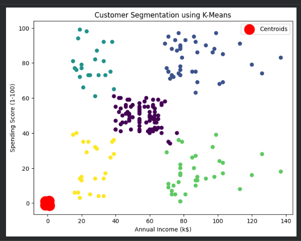
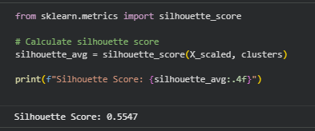

#  Customer Segmentation using K-Means Clustering

##  Project Overview
This project focuses on **customer segmentation** using the **K-Means clustering algorithm** to identify distinct customer groups based on their purchasing behavior.  
By analyzing customer income and spending patterns, the project provides **actionable business insights** that can help organizations improve marketing strategies and customer targeting.

The dataset used is the **Mall Customers Dataset**, a widely used dataset for clustering and customer analytics tasks.

---

##  Objective
The main objective of this project is to:
- Segment customers into meaningful groups using unsupervised learning
- Understand customer behavior patterns
- Support data-driven business decisions and targeted marketing strategies

---

##  Dataset Information
**Source:** Kaggle – Mall Customers Dataset  
**Link:**https://www.kaggle.com/datasets/abdallahwagih/mall-customers-segmentation

**Key Features Used:**
- `Age`
- `Annual Income (k$)`
- `Spending Score (1–100)`

These features help identify purchasing behavior and income-based segmentation.

---

##  Project Workflow

### 1️⃣ Data Exploration & Cleaning
- Loaded and inspected the dataset
- Checked for missing or null values
- Verified data types and consistency
- Selected relevant features for clustering

---

### 2️⃣ Exploratory Data Analysis (EDA)
- Analyzed relationships between income, age, and spending score
- Observed customer distribution patterns
- Identified potential clustering tendencies visually

---

### 3️⃣ Feature Scaling
- Applied **StandardScaler** to normalize numerical features
- Ensured equal contribution of all features during distance calculations

---

### 4️⃣ Choosing Optimal Number of Clusters
- Used the **Elbow Method** to determine the optimal value of `K`
- Evaluated clustering quality using the **Silhouette Score**

**Silhouette Score Obtained:** `0.5547`  
This indicates good cluster separation and reliable grouping.

---

### 5️⃣ K-Means Clustering
- Applied K-Means algorithm with the optimal number of clusters
- Assigned cluster labels to each customer
- Visualized the clusters for better interpretability
- Customer Segmentation Visualization

---

## 📊 Cluster Interpretation & Business Insights

### 🔵 Cluster 0 – High Income, High Spending
- Premium customers with strong purchasing power  
- **Strategy:** Loyalty programs, premium services, exclusive offers  

### 🟣 Cluster 1 – Average Income, Average Spending
- Stable and consistent customer base  
- **Strategy:** Personalized promotions and seasonal offers  

### 🟡 Cluster 2 – Low Income, Low Spending
- Price-sensitive customers  
- **Strategy:** Budget-friendly products and discounts  

### 🟢 Cluster 3 – High Income, Low Spending
- Financially capable but cautious spenders  
- **Strategy:** Targeted promotions and value-based messaging  

### 🔵 Cluster 4 – Low Income, High Spending
- Impulsive or trend-driven buyers  
- **Strategy:** Limited-time offers and controlled marketing campaigns  

---

##  Key Insights
- K-Means clustering effectively segments customers into meaningful groups.
- Clear behavioral differences exist across income and spending patterns.
- The model supports strategic marketing and customer retention decisions.

---
## 📈 Model Evaluation (Silhouette Score)

In this project, the silhouette score confirms that the selected number of clusters
provides a good balance between cluster compactness and separation.

##  Tools & Technologies Used
- **Python**
- **Pandas, NumPy**
- **Matplotlib, Seaborn**
- **Scikit-learn**
- **Google Colab**

---

##  Future Enhancements
- Include demographic attributes such as gender and age groups
- Apply advanced clustering techniques (DBSCAN, Hierarchical Clustering)
- Perform RFM (Recency, Frequency, Monetary) analysis
- Build an interactive dashboard for real-time insights

---
## Conclusion

This project successfully applied K-Means clustering to segment customers based on their income and spending behavior. By using proper data preprocessing, feature scaling, and model evaluation techniques, meaningful customer groups were identified.

The analysis demonstrated how unsupervised learning can uncover hidden patterns in customer data and support data-driven marketing decisions. Overall, the project highlights the practical application of machine learning for customer segmentation and provides a strong foundation for further business analytics and optimization.

---
